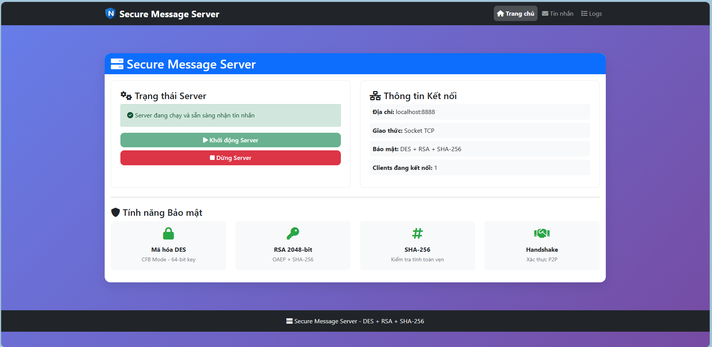
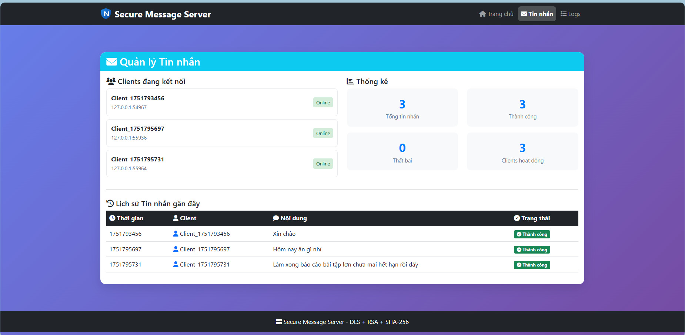
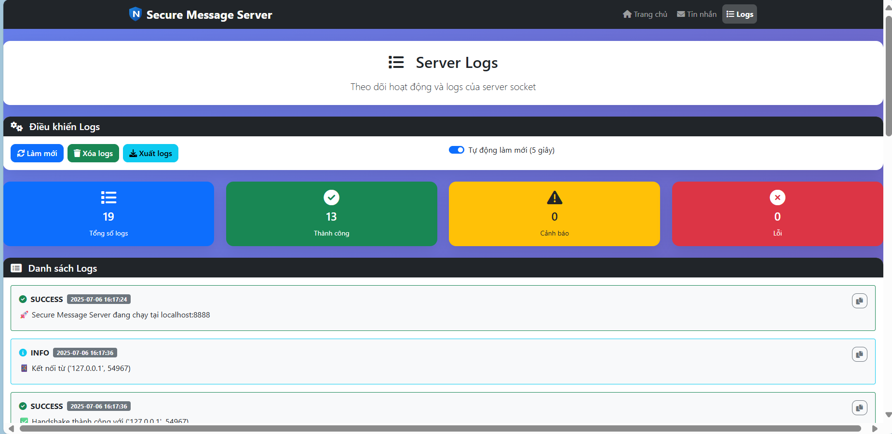
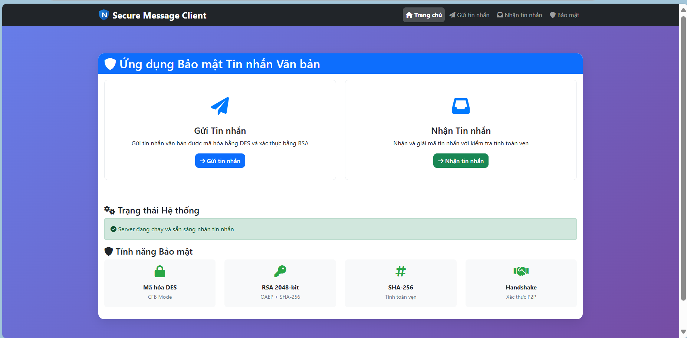
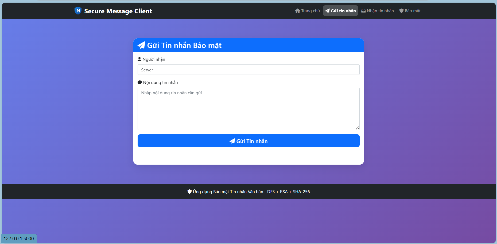
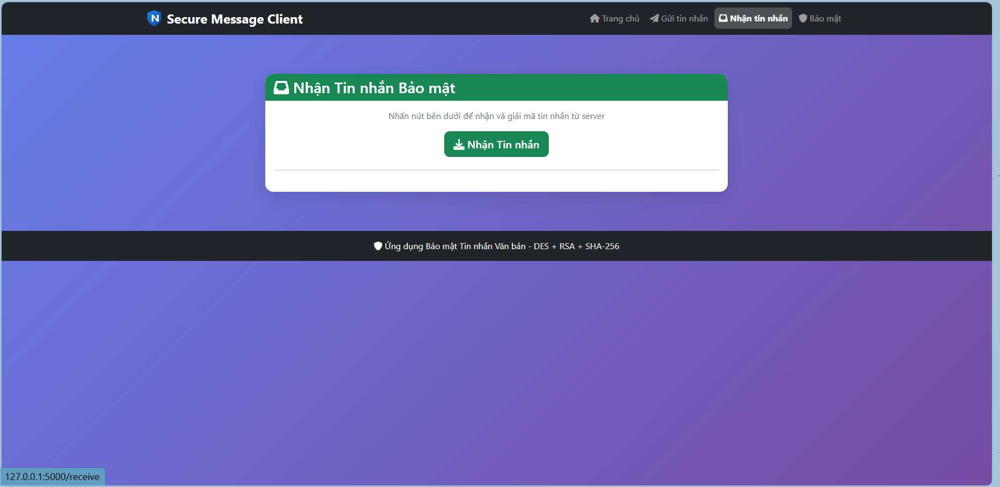
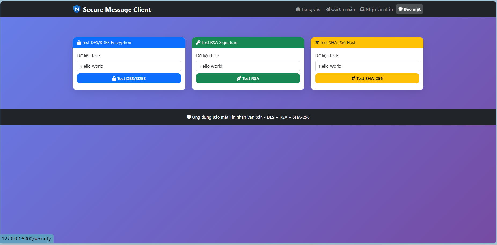

<h1 align="center">ỨNG DỤNG BẢO MẬT TIN NHẮN VĂN BẢN</h1>

<p align="center">
  
  
</p>

<div align="center">

[](https://dainam.edu.vn/vi/khoa-cong-nghe-thong-tin)
[](https://dainam.edu.vn)

</div>


## 🎯 Giới thiệu bài toán
Một hệ thống bảo mật cho ứng dụng nhắn tin văn bản, nơi nội dung tin nhắn được mã hóa bằng **DES** để đảm bảo bí mật, trong khi danh tính người gửi và người nhận được xác thực bằng **RSA**. Hệ thống sử dụng hàm băm **SHA-256** để kiểm tra tính toàn vẹn của thông điệp.

## 🔒 Tính năng Bảo mật

- **Mã hóa**: DES (CFB mode) - 64-bit key
- **Trao khóa & ký số**: RSA 2048-bit (OAEP + SHA-256)
- **Kiểm tra tính toàn vẹn**: SHA-256
- **Handshake**: Xác thực P2P qua Socket TCP

## 📂 Cấu trúc Thư mục
```
btlN/
├── client_app.py          # Flask app cho client
├── server_app.py          # Flask app cho server
├── crypto_utils.py        # Thư viện mã hóa (DES, RSA, SHA-256)
├── socket_client.py       # Client socket để gửi tin nhắn
├── socket_server.py       # Server socket để nhận tin nhắn
├── run_both.py           # Script chạy cả client và server
├── requirements.txt      # Dependencies
├── templates/            # HTML templates
│   ├── client_base.html
│   ├── client_index.html
│   ├── client_send.html
│   ├── client_receive.html
│   ├── server_base.html
│   ├── server_index.html
│   └── server_messages.html
└── static/              # CSS, JS files
```

## 🚀 Cài đặt

1.  Clone repository:
- bashgit clone <repository-url>.
- cd BTL.

 2. Cài đặt dependencies:
  ```bash
  pip install -r requirements.txt
  ```

## 🎮 Chạy ứng dụng
### Khởi động Server và Client cùng lúc

1. Sử dụng script run_both.py để chạy cả server và client cùng lúc:python run_both.py
2. Server sẽ chạy tại: http://localhost:5001
3. Client sẽ chạy tại: http://localhost:5000

- **Hướng dẫn:**
1. Truy cập http://localhost:5001 để khởi động server socket.
2. Truy cập http://localhost:5000 để gửi/nhận tin nhắn.
3. Nhấn Ctrl+C để dừng cả hai ứng dụng.


### Khởi động riêng lẻ

1. Khởi động Server: **python server_app.py**

 - Server sẽ chạy tại: http://localhost:5001

2. Khởi động Client:**python client_app.py**

- Client sẽ chạy tại: http://localhost:5000

**Lưu ý:** Đảm bảo server được khởi động trước khi chạy client.


### 🌐 Sử dụng

1. Khởi động Server:
- Truy cập http://localhost:5001 và nhấn "Khởi động Server" để kích hoạt server socket.**


2. Gửi tin nhắn:

- Truy cập http://localhost:5000. Vào trang "Gửi tin nhắn" và nhập nội dung tin nhắn, sau đó gửi.


3. Nhận tin nhắn:

- Vào trang "Nhận tin nhắn" tại http://localhost:5000 để xem tin nhắn đã được giải mã.


4. Kiểm tra bảo mật:

- Vào trang "Bảo mật" tại http://localhost:5000 để test các thuật toán mã hóa (DES, RSA, SHA-256).


## ✨ Các Chức Năng Của Bài

### 1. Gửi và Nhận Tin Nhắn An Toàn:

- Người dùng có thể gửi tin nhắn được mã hóa bằng DES và xác thực bằng RSA/SHA-256 thông qua giao diện web.
- Tin nhắn được giải mã và hiển thị tại trang "Nhận tin nhắn" với thông tin về người gửi và thời gian.


 ### 2. Xác Thực và Trao Đổi Khóa:

- Hỗ trợ handshake P2P để xác thực giữa client và server.
- Trao đổi khóa DES mã hóa bằng RSA công khai để đảm bảo an toàn trong quá trình truyền tải.


 ### 3. Kiểm Tra Tính Toàn Vẹn:

- Sử dụng SHA-256 để tạo hash và kiểm tra tính toàn vẹn của tin nhắn, phát hiện bất kỳ sửa đổi nào trong quá trình truyền.


### 4. Kiểm Thử Thuật Toán Mã Hóa:

- Cung cấp các API để test mã hóa DES, chữ ký RSA, và hash SHA-256 với dữ liệu mẫu, giúp người dùng đánh giá hiệu quả bảo mật.


### 5. Quản Lý Server:

- Cho phép khởi động, dừng, và kiểm tra trạng thái server thông qua giao diện web hoặc API.
- Hiển thị danh sách client kết nối và lịch sử tin nhắn trên server.


### 6. Ghi Nhận Log:

- Ghi lại các hoạt động quan trọng như kết nối, lỗi, và xử lý tin nhắn trong log server để hỗ trợ gỡ lỗi và theo dõi.


## 📡 API Endpoints
### Client API

- GET / - Trang chủ client
- GET /send - Trang gửi tin nhắn
- GET /receive - Trang nhận tin nhắn
- POST /api/send-message - Gửi tin nhắn
- POST /api/receive-message - Nhận tin nhắn
- POST /api/test-des - Test mã hóa DES
- POST /api/test-rsa - Test chữ ký RSA
- POST /api/test-sha256 - Test hash SHA-256

### Server API

- GET / - Trang chủ server
- GET /messages - Quản lý tin nhắn
- GET /logs - Xem logs
- POST /api/start-server - Khởi động server socket
- POST /api/stop-server - Dừng server socket
- GET /api/server-status - Trạng thái server
- GET /api/connected-clients - Danh sách clients
- GET /api/server-logs - Logs server

## 🔐 Bảo mật

 - ✅DES Encryption: Sử dụng CFB mode với IV ngẫu nhiên
 - ✅RSA Key Exchange: 2048-bit keys với OAEP padding
 - ✅Digital Signatures: RSA/SHA-256 cho xác thực
 - ✅Integrity Check: SHA-256 hash để phát hiện tampering
 - ✅Secure Handshake: Xác thực hai chiều qua Socket TCP

## ⚠️ Lưu ý

  - ❌ Đây là ứng dụng demo cho mục đích học tập.
  - ❌ Trong môi trường production, nên sử dụng các thuật toán mã hóa hiện đại hơn như AES.
  - ❌ DES được sử dụng theo yêu cầu đề bài, nhưng không được khuyến nghị trong thực tế.
  - ❌ Đảm bảo server được khởi động trước khi client gửi tin nhắn.

## 🖥️ Giao diện và hoạt động

### Trang Server
1. **Trang chủ**
  

2. **Trang Quản lý tin nhắn**
  

3. **Trang Logs**
  

### Trang Client
1. **Trang chủ**
  

2. **Trang Gửi tin nhắn**
  

3. **Trang nhận tin nhắn**
  

4. **Trang bảo mật**
  

  © 2025 NHÓM 6, CNTT16-04, TRƯỜNG ĐẠI HỌC ĐẠI NAM
